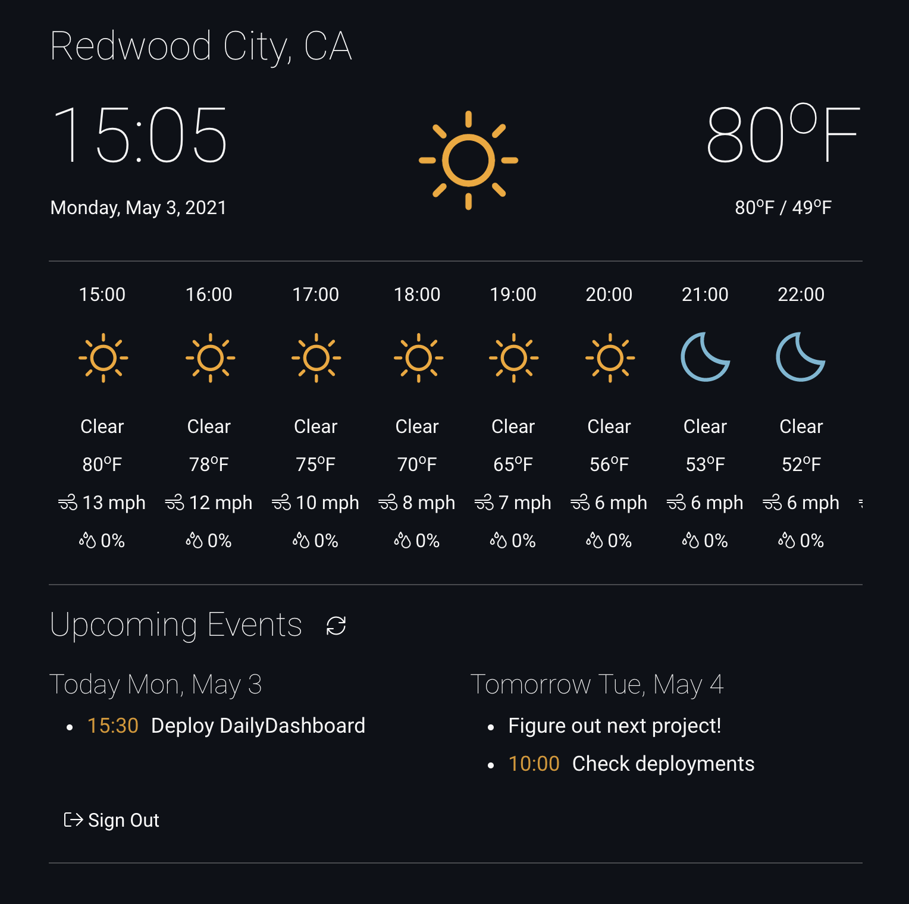

# Daily Dashboard

Provides a simple "at a glance" dashboard with the following information:

1. Current Date Time
2. Current Temperature with high and low for the day
3. Hourly weather forecast containing the outlook, temperature, wind speed and precipitation percentage.
4. List of upcoming calendar events for today and tomorrow.



## Weather

This application uses the [OpenWeather API](https://openweathermap.org/api) to retrieve the latest weather forecasts. Sign up is free with some limitations on the number of calls you can make in a 24hr period. Note that it can take a couple of hours for your api key to become active upon creation.

Once you have an api key update the `app-config.js` file along with the lat and lon of the location you wish to retrieve the weather for:

```javascript
{
    openWeather: {
        apiKey: "INSERT KEY HERE",
        lat: "INSERT LATITUDE HERE",
        lon: "INSERT LONGITUDE HERE"
    }
}
```

The application makes use of the [One Call API](https://openweathermap.org/api/one-call-api) to retrieve the current, daily and hourly forecast information together in one call.

- The current forecast is used in the top panel for current temperature and outlook.
- The daily forecast is used to extract the high and low for the current day.
- The hourly forecast is used to display, well, the hourly forecast :)

Weather refreshes every fifteen minutes.

### Weather Icons

OpenWeather provides its own [set of icons](https://openweathermap.org/weather-conditions) but i much prefer the look of the [Weather Underground](https://github.com/manifestinteractive/weather-underground-icons) icons. They're super clean and come in a variety of sizes. I implemented a simple mapping hash `WEATHER_ICON_MAPPING` in `constants.js`.

## Google Calendar

To use this feature, you'll need to create a Google Calendar API application:

1. login or sign up for a [Google Cloud Account](https://console.cloud.google.com/).
2. create an application
3. enable the [Google Calendar API](https://developers.google.com/calendar)
4. create both an API Key AND an OAuth 2.0 Client ID in the credentials section.

A note on OAuth 2.0 Credentials: make sure you update the `Authorized Javascript origins` and `Authorized redirect URIs` sections to include localhost:PORT when running locally or with your domain name if deployed on your own servers.

Once this is done just copy your api key and client id and update the `app-config.js` file in the `googleCalendar` property:

```javascript
{
    googleCalendar: {
        apiKey: "INSERT KEY HERE",
        clientId: "INSERT ID HERE"
    }
}
```
